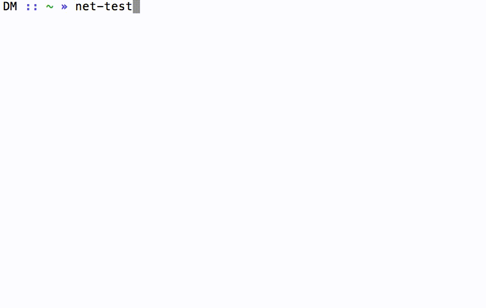

# net-test [](https://travis-ci.org/chester1000/net-test) [](https://david-dm.org/chester1000/net-test)

> Test the quality of your wifi (using [speedtest.net](http://www.speedtest.net)) and get the results saved for future reference.




## Install

```
$ npm install --global net-test
```


## Usage

```
$ net-test --help

  Usage
    $ net-test

  Options
    --json  Output the result as JSON
```


## License

MIT © [Damian Mee](http://meedamian.com)
